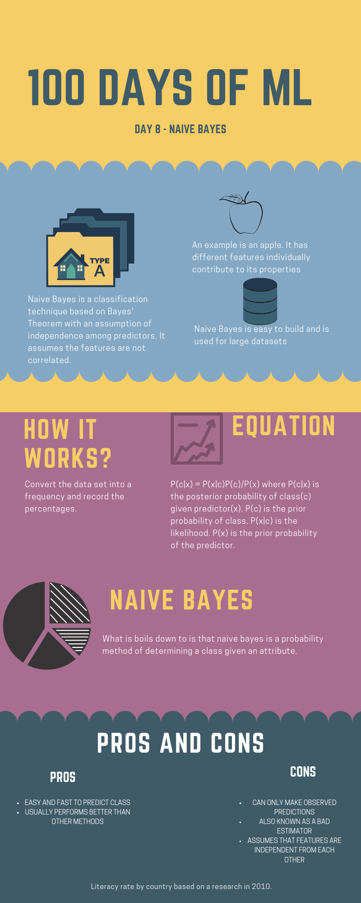
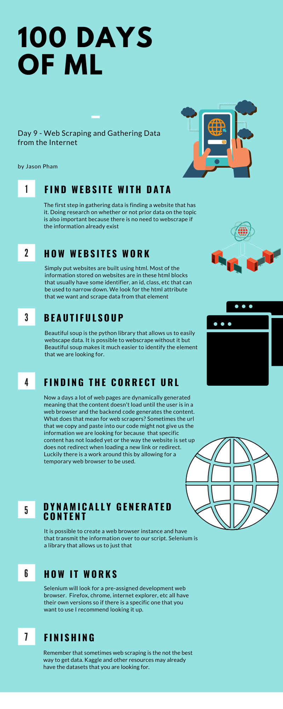

# Welcome to 100 days of ML by Jason Pham

First 54 days take from [Avik Jain's](https://github.com/Avik-Jain/100-Days-Of-ML-Code) 100 day challenge. Will create my own once Avik's runs out

# Day 1 - Preproccessing Data

  

# Day 2 - Linear Regression

  

# Day 3 - Multidimensional Linear Regression

  

# Day 4 - Logistic Regression

  

# Day 5 - Implementing KNN

  

# Day 6 - KNN with Sklearn

  

# Day 7 - Support Vector Machines

  

# Day 8 - Naive Bayes

  

# Day 9 - Web Scraping

  

# Day 10 - Andrew Ng's ML course Day 1

Started watching and taking notes on his video lectures. Will create a infographic at the end of each section
[Link to Video series](https://www.youtube.com/watch?v=kHwlB_j7Hkc&list=PLLssT5z_DsK-h9vYZkQkYNWcItqhlRJLN&index=4)

# Day 11 - Andrew Ng's ML course Day 2

[Implemented Single Variable Linear Regression](/Day%2011/day-11.ipynb)

    <a href="Day 11/animation.gif"> Link to GIF </a>

# Day 12 - Andrew Ng's ML course Day 3

[Implemented MultiVariable Linear Regression](/Day%2012/day-12.ipynb)

# Day 13 - Andrew Ng's ML course Day 4

[Implemented Logistic Regression](/Day%2013/day-13.ipynb)

# Day 14 - Catch up Day

Worked on fixing up some bad code and worked on visualizing multivariate linear regression

# Day 15 - Regularization

Applied regularization to my previous implemenations of linear and logistic regression to improve the training performance. No noticiable difference between the first and this implementation probably due to the lack of complicated datasets