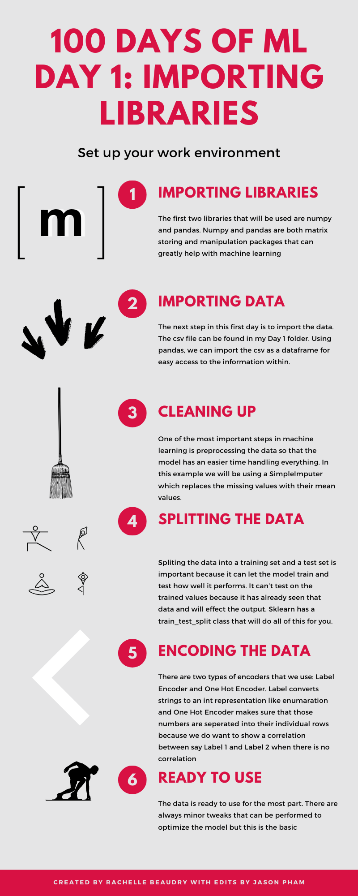
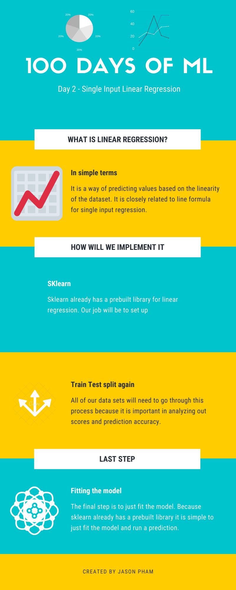
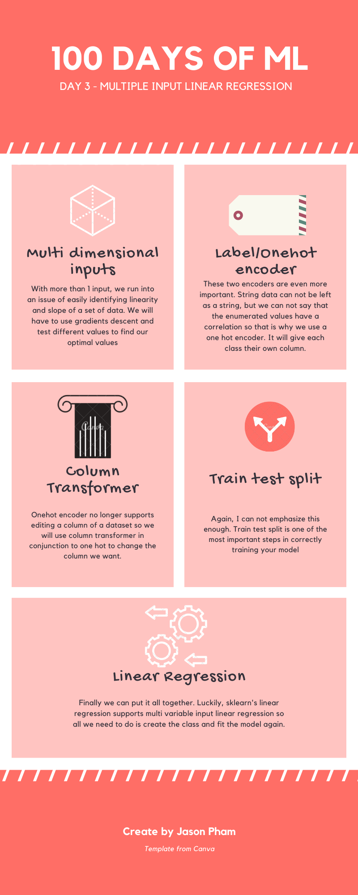
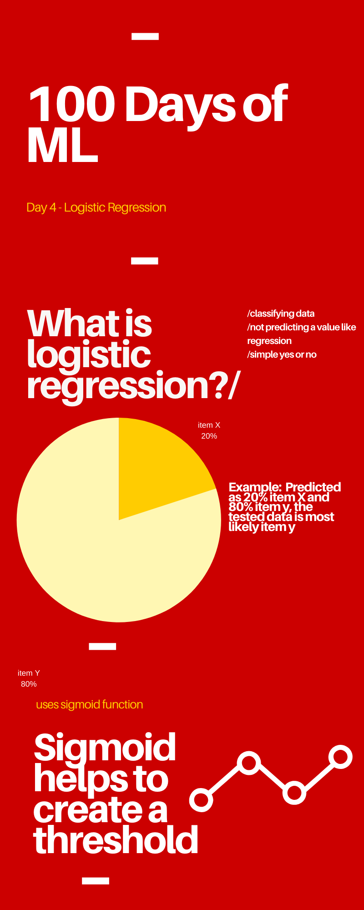
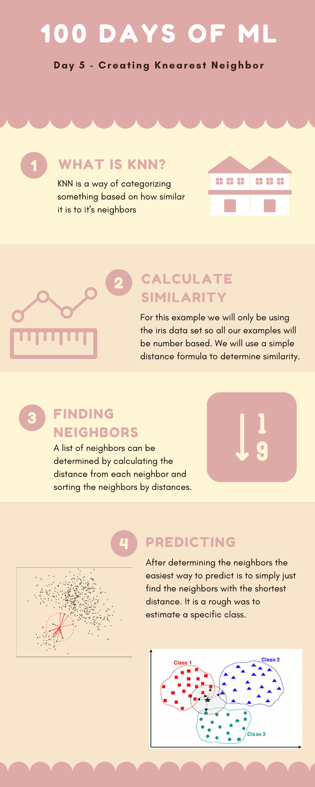
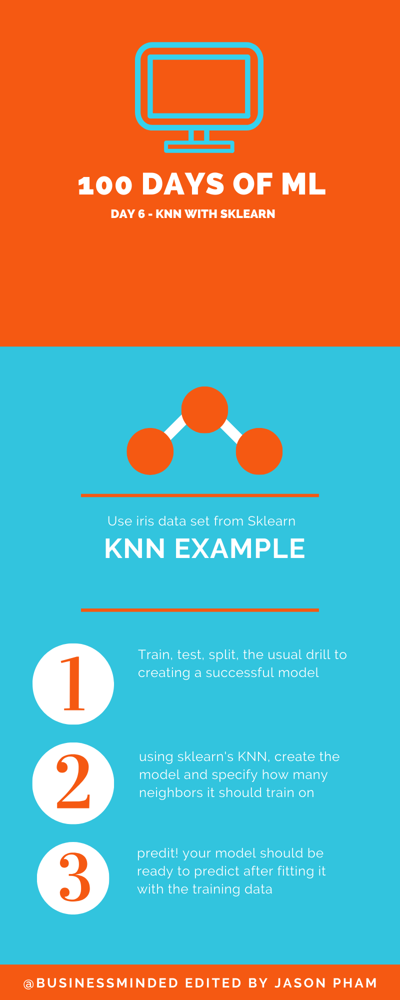
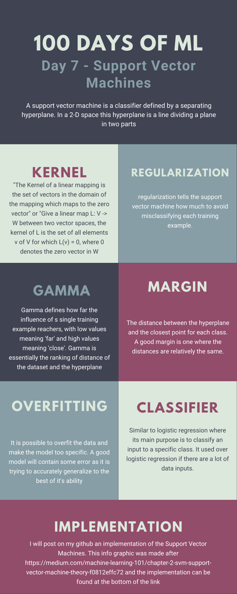

# Welcome to 100 days of ML by Jason Pham

First 54 days take from [Avik Jain's](https://github.com/Avik-Jain/100-Days-Of-ML-Code) 100 day challenge. Will create my own once Avik's runs out

# Day 1 - Preproccessing Data

  

# Day 2 - Linear Regression

  

# Day 3 - Multidimensional Linear Regression

  

# Day 4 - Logistic Regression

  

# Day 5 - Implementing KNN

  

# Day 6 - KNN with Sklearn

  

# Day 7 - Support Vector Machines

  

